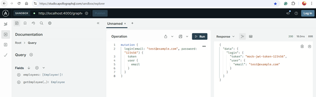

## 101431281_COMP3133_ASSIGNMENT2

## Student Info
- Name: Nigar Ahmadova
- Student ID: 101431281
- Course: COMP3133 – Full Stack Development
- Semester: Winter 2025
- Instructor: Pritesh Patel

## Project Overview
This is a full-stack Employee Management App built using Angular for the frontend and GraphQL (Apollo Server + Express) for the backend. The goal of the application is to implement CRUD operations, user authentication, file upload, and routing using Angular best practices.

## You can:
- Register and log in securely.
- Add, update, view, and delete employees.
- Upload employee pictures.
- Use GraphQL for data communication.
- Deploy both frontend and backend.

## Project Structure
101431281_COMP3133_ASSIGNMENT2/
│
├── backend/
│   ├── index.js
│   ├── package.json
│   ├── package-lock.json
│   └── node_modules/
├── src/
│   └── app/
│       ├── components/
│       │   ├── employee-add/
│       │   │   ├── employee-add.component.ts
│       │   │   ├── employee-add.component.html
│       │   │   ├── employee-add.component.css
│       │   │   └── employee-add.component.spec.ts
│       │   ├── employee-details/
│       │   │   ├── employee-details.component.ts
│       │   │   ├── employee-details.component.html
│       │   │   ├── employee-details.component.css
│       │   │   └── employee-details.component.spec.ts   
│       │   ├── employee-list/
│       │   │   ├── employee-list.component.ts
│       │   │   ├── employee-list.component.html
│       │   │   ├── employee-list.component.css
│       │   │   └── employee-list.component.spec.ts
│       │   ├── employee-update/
│       │   │   ├── employee-update.component.ts
│       │   │   ├── employee-update.component.html
│       │   │   ├── employee-update.component.css
│       │   │   └── employee-update.component.spec.ts
│       │   ├── login/
│       │   │   ├── login.component.component.ts
│       │   │   ├── login.component.component.html
│       │   │   ├── login.component.component.css
│       │   │   └── login.component.component.spec.ts
│       │   ├── signup/
│       │   │   ├── signup.component.component.ts
│       │   │   ├── signup.component.component.html
│       │   │   ├── signup.component.component.css
│       │   │   └── signup.component.component.spec.ts
│       │   │── navbar/
│       │   │   ├── navbar.component.component.ts
│       │   │   ├── navbar.component.component.html
│       │   │   ├── navbar.component.component.css
│       │   │   └── navbar.component.component.spec.ts
│       ├── graphql/
│       │   ├── queries.ts
│       │   └── mutations.ts
│       ├── app.component.ts
│       ├── app.component.html
│       │── app.component.spec.ts   
│       ├── app.component.css
│       ├── app.config.ts
│       ├── app.routes.ts
│       ├── auth.guard.ts
│       └── auth.guard.spec.ts
├── styles.css
├── index.html
├── main.ts
├── angular.json
├── package.json
├── package-lock.json
├── tsconfig.app.json
├── tsconfig.json
├── tsconfig.spec.json
├── .gitignore
├── .editorconfig
└── README.md

## Tech Stack
- Frontend: Angular 17 + Angular Material
- Backend: Node.js + Express + Apollo Server
- API: GraphQL
- Hosting: Render

## Getting Started
### Backend:
- cd backend
- npm install
- node index.js
- Runs on: http://localhost:4000/graphql

### Frontend (Angular):
- npm install
- ng serve
- Runs on: http://localhost:4200

## Features
- Login / Signup Authentication using GraphQL.
- Session Management with Auth Guard.
- Employee Management (CRUD):
    - Employee List (Table UI);
    - Add New Employee with picture upload;
    - View Employee Details;
    - Update Employee Info;
    - Delete Employee.
- Search by department or job position.
- Session storage for authenticated .
- Router Navigation.
- Responsive UI/UX with Angular Material Design.
- Friendly validation error messages for all forms.
- Navbar with Logout.

## Links:
- [GitHub Repository](https://github.com/Nigar0826/101431281_comp3133_assignment2)
- [Live Frontend Deployment](https://one01431281-comp3133-assignment2.onrender.com)
- [Live Backend (GraphQL Endpoint)](https://employee-management-backend-rf1o.onrender.com/graphql)

## Screenshots
### Signup

### Login

### Employee List

### Add Employee

### View Employee Details

### Update Employee

### Delete Employee

### Filter Employee

